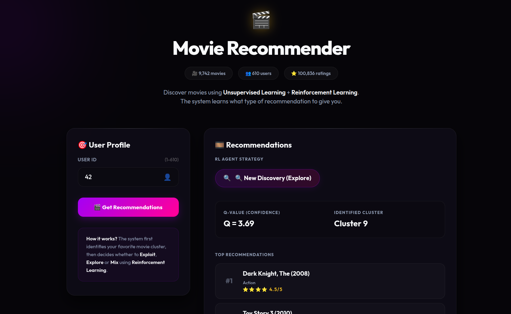
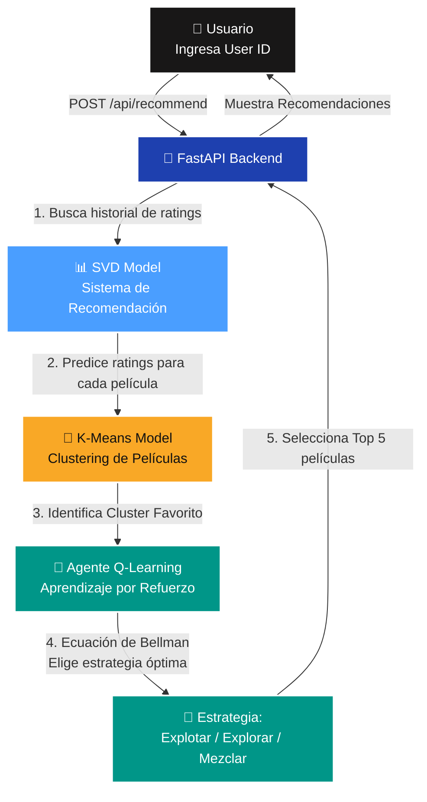
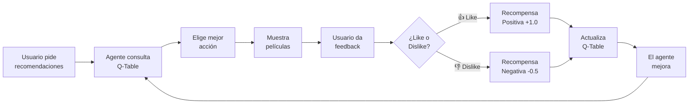

<div align="center">
  <h1>🎬 Movie Recommender with RL</h1>
  <p><i>Sistema de recomendación de películas que combina Aprendizaje No Supervisado, Reinforcement Learning y una arquitectura MLOps Serverless.</i></p>
  
  [](https://www.python.org)
  [](https://github.com/astral-sh/uv)
  [](https://fastapi.tiangolo.com)
  [](https://scikit-learn.org/)
  [](https://grouplens.org/datasets/movielens/latest/)
</div>

---

## 🌐 Live Demo & UI

¡Explora la aplicación desplegada en producción!
**🔗 [Live Demo en Render](https://learning-recommendation-engine.onrender.com/)**



---

## 📖 Sobre el Proyecto

Este proyecto es una aplicación de recomendación de películas que combina técnicas avanzadas de Machine Learning para ofrecer recomendaciones personalizadas e inteligentes. El sistema utiliza:

- **Aprendizaje No Supervisado (K-Means):** Para agrupar películas por similitud de géneros y descubrir patrones ocultos.
- **Sistema de Recomendación (SVD):** Para predecir calificaciones de usuarios basado en factorización matricial.
- **Aprendizaje por Refuerzo (Q-Learning):** Un agente inteligente que aprende qué estrategia de recomendación usar para cada usuario.

El sistema resuelve un problema secuencial real:
1. No tenemos etiquetas previas sobre los gustos de los usuarios.
2. Necesitamos tomar decisiones que maximicen la satisfacción del usuario a largo plazo.
3. El sistema debe adaptarse y aprender de las interacciones del usuario.

---

## 📊 Los Datos

Se utilizó el dataset **MovieLens Latest Small**, un dataset público y real de calificaciones de películas:

**[MovieLens Latest Small Dataset](https://grouplens.org/datasets/movielens/latest/)**

| Característica | Valor |
|----------------|-------|
| **Calificaciones** | 100,836 |
| **Usuarios** | 610 |
| **Películas** | 9,742 |
| **Formato** | CSV con cabeceras |
| **Escala de ratings** | 0.5 - 5.0 estrellas |
| **Géneros** | 19 géneros (pipe-separated) |

**Archivos del dataset:**
- `ratings.csv`: Calificaciones de usuarios (userId, movieId, rating, timestamp)
- `movies.csv`: Información de películas (movieId, title, genres)
- `tags.csv`: Etiquetas generadas por usuarios (userId, movieId, tag, timestamp)
- `links.csv`: Enlaces a IMDb y TMDB (movieId, imdbId, tmdbId)

---

## 🧠 Arquitectura del Sistema

### Flujo de Inferencia



### Componentes del Sistema

#### 1. Clustering (K-Means) - Aprendizaje No Supervisado
Agrupa las 9,742 películas en **10 clusters** basados en sus géneros. Cada cluster representa un grupo de películas similares:

| Cluster | Géneros predominantes | Ejemplos de películas |
|---------|----------------------|----------------------|
| 0 | Action, Adventure, Sci-Fi | Star Wars, The Matrix |
| 1 | Comedy, Romance | When Harry Met Sally |
| 2 | Drama, Crime | The Godfather, Pulp Fiction |
| 3 | Animation, Children | Toy Story, Frozen |
| 4 | Horror, Thriller | The Shining, Psycho |
| 5 | Documentary | March of the Penguins |
| 6 | Musical, Romance | La La Land, Moulin Rouge |
| 7 | War, Western | Saving Private Ryan |
| 8 | Film-Noir, Mystery | The Third Man |
| 9 | Adventure, Action, Drama | Interstellar, Inception |

#### 2. Sistema de Recomendación (SVD) - Factorización Matricial
Utiliza **Factorización Matricial** para predecir qué calificación daría un usuario a una película que no ha visto. El modelo fue entrenado con:

- **Hiperparámetros optimizados:** n_factors=100, n_epochs=30, lr_all=0.01, reg_all=0.05
- **Métricas:** RMSE=0.8567, MAE=0.6562

#### 3. Agente RL (Q-Learning) - Aprendizaje por Refuerzo
Un agente inteligente que aprende qué **estrategia de recomendación** usar para cada cluster:

| Acción | Estrategia | Descripción |
|--------|-----------|-------------|
| ⭐ **Exploit** | Popular Choice | Recomienda las películas más populares del cluster favorito |
| 🔍 **Explore** | New Discovery | Recomienda películas de otros clusters (descubrimiento) |
| 🎭 **Mix** | Similar Taste | Recomienda películas de clusters cercanos (equilibrio) |

El agente utiliza una **Q-Table** (6x3) que almacena el valor de cada acción para cada estado, y se actualiza en tiempo real con el feedback del usuario.

---

## 🏗️ Estructura del Proyecto

```text
learning-recommendation-engine/
│
├── .github/workflows/       # Pipelines MLOps (CI/CD/CT)
│   ├── ci.yml               # Integración Continua
│   ├── cd.yml               # Despliegue Continuo
│   └── ct.yml               # Entrenamiento Continuo (Cron)
│
├── data/
│   ├── raw/                 # Dataset original MovieLens
│   │   └── ml-latest-small/
│   │       ├── ratings.csv
│   │       ├── movies.csv
│   │       ├── tags.csv
│   │       └── links.csv
│   └── processed/           # Datos procesados
│       ├── ratings_clean.csv
│       ├── movies_with_genres.csv
│       └── movies_with_clusters.csv
│
├── src/
│   ├── api/                 # Backend FastAPI
│   │   ├── main.py          # Punto de entrada
│   │   └── schemas.py       # Esquemas Pydantic
│   │
│   ├── ml/                  # Lógica de Machine Learning
│   │   ├── clustering/      # K-Means
│   │   │   ├── train_clustering.py
│   │   │   └── infer_cluster.py
│   │   ├── recommendation/  # SVD
│   │   │   └── train_svd.py
│   │   └── reinforcement/   # Q-Learning
│   │       ├── agent.py
│   │       ├── environment.py
│   │       └── train_agent.py
│   │
│   ├── models/              # Artefactos (modelos serializados)
│   │   ├── movie_kmeans.pkl
│   │   ├── movie_scaler.pkl
│   │   ├── svd_model.pkl
│   │   ├── q_table.json
│   │   ├── clustering_metrics.json
│   │   ├── svd_metrics.json
│   │   └── rl_metrics.json
│   │
│   ├── static/              # Archivos estáticos (CSS)
│   │   └── style.css
│   │
│   └── templates/           # Templates HTML
│       └── index.html
│
├── scripts/                 # Scripts de utilidad
│   └── preprocess_data.py
│
├── notebooks/               # Jupyter notebooks (EDA)
│
├── tests/                   # Pruebas unitarias
│   └── test_ml.py
│
├── pyproject.toml           # Dependencias (uv)
├── README.md                # Este archivo
└── Dockerfile               # Despliegue en contenedor
```

---

## 📈 Métricas y Quality Gates

### 1. Clustering (K-Means)
| Métrica | Valor | Quality Gate |
|---------|-------|--------------|
| **Silhouette Score** | 0.2481 | ≥ 0.20 |
| **Davies-Bouldin** | 1.3042 | ≤ 1.50 |
| **Número de Clusters** | 10 | Automático (Silhouette Method) |

### 2. Sistema de Recomendación (SVD)
| Métrica | Valor | Parámetros Óptimos (GridSearch) |
|---------|-------|--------------------------------|
| **RMSE** | 0.8671 | n_factors = 50 |
| **MAE** | 0.6646 | n_epochs = 20, lr_all = 0.01 |

### 3. Agente RL (Q-Learning)
| Métrica | Valor | Descripción |
|---------|-------|-------------|
| **Avg Reward (Train)** | 0.7931 | Recompensa promedio en entrenamiento |
| **Avg Reward (Val)** | 0.7828 | Recompensa en ambiente simulado |
| **Episodios** | 5,000 | Iteraciones de aprendizaje |

---

## 🔄 Ciclo de Aprendizaje del Agente RL



---

## 🚀 Inicio Rápido (Local)

Ejecutar la plataforma toma segundos gracias a `uv`.

```bash
# 1. Instalar dependencias
uv sync

# 2. Descargar y preparar el dataset
# Descarga ml-latest-small.zip desde https://grouplens.org/datasets/movielens/latest/
# Descomprime en data/raw/ml-latest-small/

# 3. Preprocesar datos (UNA SOLA VEZ)
uv run python scripts/preprocess_data.py

# 4. Entrenar modelos en orden
uv run python src/ml/clustering/train_clustering.py
uv run python src/ml/recommendation/train_svd.py
uv run python src/ml/reinforcement/train_agent.py

# 5. Levantar la aplicación web
uv run uvicorn src.api.main:app --reload
```

Abre `http://127.0.0.1:8000` para ver la interfaz interactiva.

---

## 🎯 Casos de Uso

### Usuario Nuevo (ID: 42)
1. Ingresa su User ID
2. El sistema identifica su cluster favorito basado en sus ratings históricos
3. El agente RL elige la mejor estrategia (Exploit/Explore/Mix)
4. Recibe 5 recomendaciones personalizadas
5. Puede dar feedback (👍/👎) para mejorar futuras recomendaciones

### Usuario Existente (ID: 100)
1. El sistema ya conoce sus gustos
2. El agente ha aprendido qué estrategia funciona mejor
3. Las recomendaciones mejoran con cada interacción
4. El Q-Value muestra la confianza del agente en cada acción

---


## 📝 Pruebas y Validación

### Pruebas Unitarias
```bash
uv run python -m pytest tests/
```

### Prueba de API
```bash
# Probar estadísticas
curl http://localhost:8000/api/stats

# Probar recomendaciones
curl -X POST http://localhost:8000/api/recommend \
  -H "Content-Type: application/json" \
  -d '{"user_id": 42}'

# Enviar feedback
curl -X POST http://localhost:8000/api/feedback \
  -H "Content-Type: application/json" \
  -d '{"user_id": 42, "movie_id": 1, "rating": 4.5, "action_taken": 0}'
```
