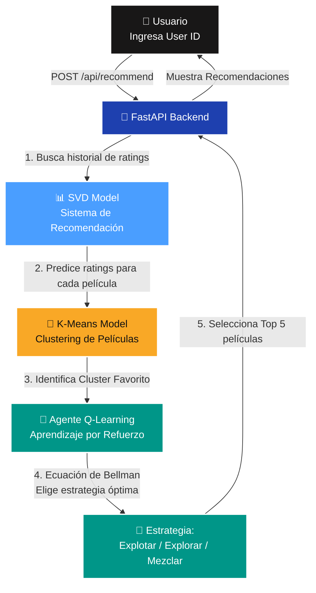

<div align="center">
  <h1>🎬 Movie Recommender with RL</h1>
  <p><i>Sistema de recomendación de películas que combina Aprendizaje No Supervisado, Reinforcement Learning y una arquitectura MLOps Serverless.</i></p>
  
  [](https://www.python.org)
  [](https://github.com/astral-sh/uv)
  [](https://fastapi.tiangolo.com)
  [](https://scikit-learn.org/)
  [](https://grouplens.org/datasets/movielens/latest/)
</div>

---

## 🌐 Live Demo & UI

¡Explora la aplicación desplegada en producción!
**🔗 [Live Demo en Render](https://learning-recommendation-engine.onrender.com/)**


---

## 📖 Sobre el Proyecto

Este proyecto es una aplicación de recomendación de películas que combina técnicas avanzadas de Machine Learning para ofrecer recomendaciones personalizadas e inteligentes. El sistema utiliza:

- **Aprendizaje No Supervisado (K-Means):** Para agrupar películas por similitud de géneros y descubrir patrones ocultos.
- **Sistema de Recomendación (SVD):** Para predecir calificaciones de usuarios basado en factorización matricial.
- **Aprendizaje por Refuerzo (Q-Learning):** Un agente inteligente que aprende qué estrategia de recomendación usar para cada usuario.

El sistema resuelve un problema secuencial real:
1. No tenemos etiquetas previas sobre los gustos de los usuarios.
2. Necesitamos tomar decisiones que maximicen la satisfacción del usuario a largo plazo.
3. El sistema debe adaptarse y aprender de las interacciones del usuario.

---

## 📊 Los Datos

Se utilizó el dataset **MovieLens Latest Small**, un dataset público y real de calificaciones de películas:

**[MovieLens Latest Small Dataset](https://grouplens.org/datasets/movielens/latest/)**

Dataset con más de 100,000 calificaciones aplicadas a 9,742 películas por 610 usuarios. Contiene 19 géneros combinables.

---

## 🧠 Arquitectura del Sistema

### Flujo de Inferencia



### Componentes del Sistema

- **Clustering (K-Means):** Agrupa automáticamente las películas en 10 clusters utilizando características de género.
- **Factorización Matricial (SVD):** Predice la puntuación de afinidad (0.5 - 5.0) con hiperparámetros optimizados.
- **Agente Q-Learning:** Decide dinámicamente si *Explotar* (géneros favoritos), *Explorar* (descubrimiento) o *Mezclar*, actualizando su Q-Table en tiempo real mediante el feedback del usuario.

---

## 🏗️ Estructura del Proyecto

```text
learning-recommendation-engine/
├── .github/workflows/       # Pipelines MLOps (CI/CD/CT)
├── data/                    # Dataset crudo y procesado
├── src/
│   ├── api/                 # Backend FastAPI
│   ├── ml/                  # K-Means, SVD, y Q-Learning
│   ├── models/              # Artefactos .pkl y .json
│   └── static/              # Assets estáticos y UI
├── tests/                   # Pruebas unitarias
└── scripts/                 # ETL y preprocesamiento
```

---

## 📈 Métricas y Quality Gates

### 1. Clustering (K-Means)
| Métrica | Valor | Quality Gate |
|---------|-------|--------------|
| **Silhouette Score** | 0.2481 | ≥ 0.20 |
| **Davies-Bouldin** | 1.3042 | ≤ 1.50 |
| **Número de Clusters** | 10 | Automático (Silhouette Method) |

### 2. Sistema de Recomendación (SVD)
| Métrica | Valor | Parámetros Óptimos (GridSearch) |
|---------|-------|--------------------------------|
| **RMSE** | 0.8671 | n_factors = 50 |
| **MAE** | 0.6646 | n_epochs = 20, lr_all = 0.01 |

### 3. Agente RL (Q-Learning)
| Métrica | Valor | Descripción |
|---------|-------|-------------|
| **Avg Reward (Train)** | 0.7931 | Recompensa promedio en entrenamiento |
| **Avg Reward (Val)** | 0.7828 | Recompensa en ambiente simulado |
| **Episodios** | 5,000 | Iteraciones de aprendizaje |

---

## 🚀 Inicio Rápido (Local)

Ejecutar la plataforma toma segundos gracias a `uv`.

```bash
# 1. Instalar dependencias
uv sync

# 2. Descargar y preparar el dataset
uv run python scripts/preprocess_data.py

# 3. Entrenar modelos en orden
uv run python src/ml/clustering/train_clustering.py
uv run python src/ml/recommendation/train_svd.py
uv run python src/ml/reinforcement/train_agent.py

# 4. Levantar la aplicación web
uv run uvicorn src.api.main:app --reload
```
Abre `http://127.0.0.1:8000` para ver la interfaz interactiva.

---
## 📝 Pruebas y Validación

### Pruebas Unitarias
```bash
uv run python -m pytest tests/
```

### Prueba de API
```bash
# Probar estadísticas
curl http://localhost:8000/api/stats

# Probar recomendaciones
curl -X POST http://localhost:8000/api/recommend \
  -H "Content-Type: application/json" \
  -d '{"user_id": 42}'

# Enviar feedback
curl -X POST http://localhost:8000/api/feedback \
  -H "Content-Type: application/json" \
  -d '{"user_id": 42, "movie_id": 1, "rating": 4.5, "action_taken": 0}'
```
